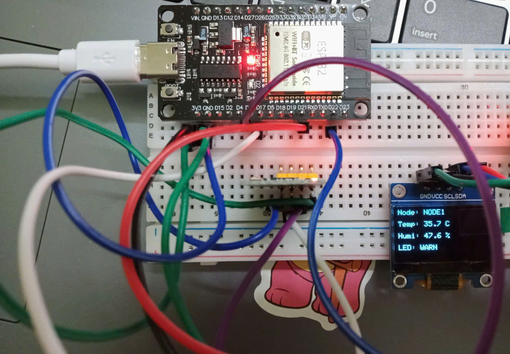
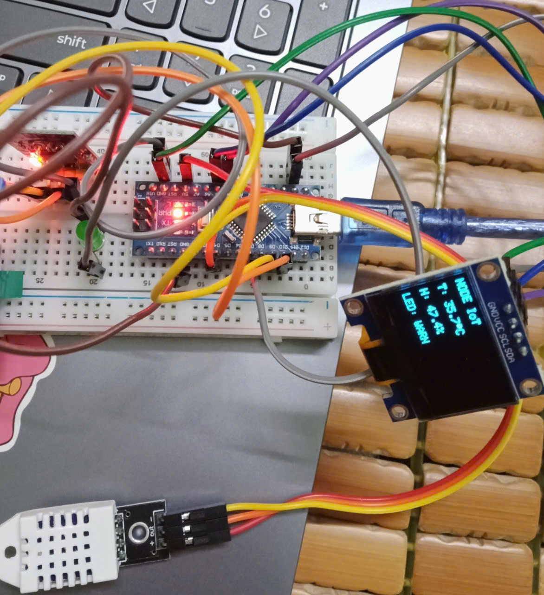
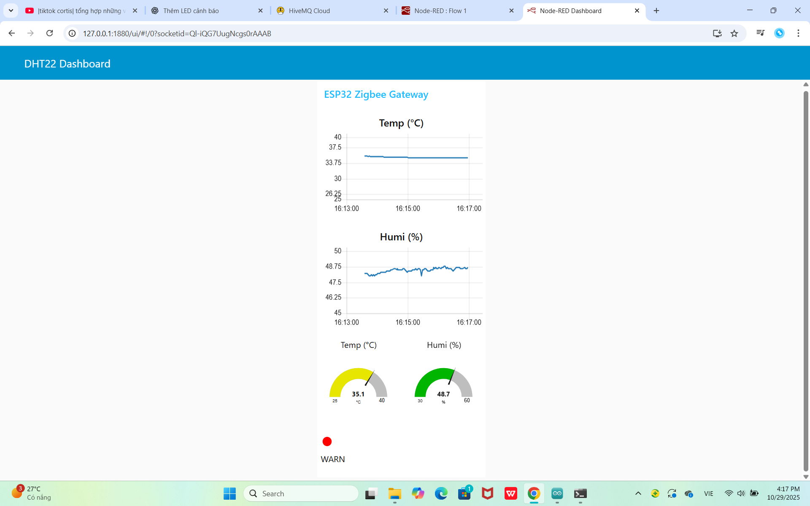

# IoT Temperature and Humidity Monitoring System
## Description
An IoT-based system for real-time temperature and humidity monitoring using ESP32, Arduino Nano, Zigbee, MQTT and Node-RED.

## Technologies
- C/C++
- ESP32
- Arduino Nano
- Zigbee
- MQTT (HiveMQ)
- Node-RED
- Arduino IDE

## Hardware Demonstration
### ESP32 Node

### Arduino Nano Node

## Dashboard

## Features
- Collect temperature and humidity data
- Wireless communication via Zigbee
- Real-time MQTT data transmission
- Dashboard monitoring with Node-RED
- OLED display support
